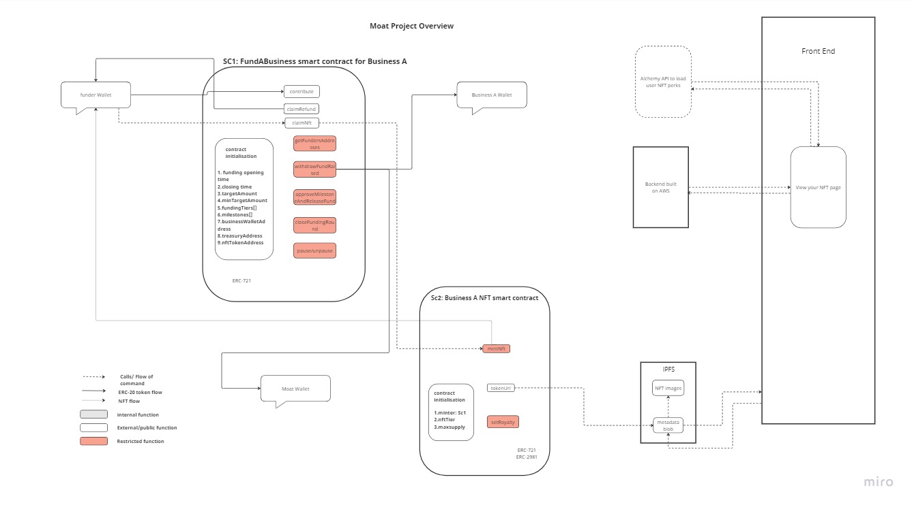
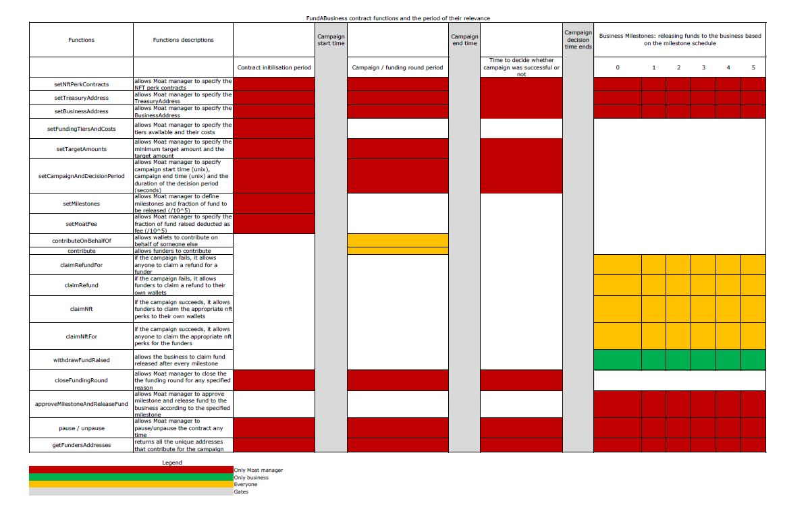

# Project Moat Smart Contracts

This is the repository for the smart contracts of Project Moat.



```
Figure 1: Overview of the implementation
```



```
Figure 2: FundABusiness functions
```

Figure 1 shows the overview of Project Moat while Figure 2 gives a
summary of each of the callable functions in the crowd-funding (FundABusiness.sol) contract.

The details about the project can be found on the [crowd-fund-frontend-backend-hackathon repo](https://github.com/CROWDDIT/crowd-fund-frontend-backend-hackathon).

## Background and Challenges We ran into

The Project Moat team first conceived the idea of a decentralised crowd-funding platform a few weeksbefore the Chainlink Hackathon started. Then we started writing the smart contracts.The FundAbusiness contract was initially developed to accept only stable coins.

However, a few days into the implementation, the USDC stable coin lost its peg. The first US bankcollapse this year happened. Then a few more banks also went under. Then, we realised that keepingstable coins on the contract for a long period of time is risky.

While we explore other options, Chainlink Hackathon started. We wanted to participate in the hackathon so we thought of ways to upgrade the project we are building. We decided to accept only ETH or native coins of the host blockchain. We used Chainlink DataFeed to fetch the real-time price of ETH and calculate the equivalent amount of every contribution. Then we proceeded to building the frontend and backend (including APIs)of the project.

## Tech-Stacks Used to build this Project

1. Hardhat framework for building smart contracts.
2. Chainlink Datafeed used for the "contribute" function in the FundABusiness contract to get the current
   price of ETH so that the value of the Tier Perks can be accurately calculated in ETH.
3. Next.js, Web3uikit and Moralis were used to build the frontend.
4. Smart contract tests, frontend and backend are written in Typescript.
5. Serverless framework was used to manage resources on AWS.
6. AWS Lambda, API Gateway and RDS Postgress were used to create the backend.
7. Alchemy API were used to fetch accounts' Moat NFTs on the View Your NFTs page.

## Running this Project Locally

To run this project locally, please clone this repo.

1. To clone this repo, run the following command on your cli;

```bash
git clone https://github.com/CROWDDIT/crowd-fund-hardhat-hackathon.git
cd crowd-fund-hardhat-hackathon.git
yarn
```

2. Then go into crowd-fund-hardhat-hackathon/utils/constants.ts, change the CAMPAIGN_PERIOD values.

CAMPAIGN_PERIOD = [unix start time, unix end time, time (in seconds) required to make a decision]

Convert a future time to unix time and enter it as the campaign to start. Similarly, convert a
later time in the future to unix time and enter it as campaign end time. You can use the
[unix timestamp convert](https://www.site24x7.com/tools/time-stamp-converter.html) to do the
conversion.

3. Ensure the frontEndContractsFile parameter in the crowd-fund-hardhat/utils/constants file is rooted to crowd-fund-frontend-backend-hackathon/constants/fundABizAddress.json and crowd-fund-frontend-backend-hackathon/constants/nftPerksAddresses.json location in the crowd-fund-frontend-backend-hackathon repo. Also, ensure frontEndAbiLocation parameter in the crowd-fund-hardhat/utils/constants file is rooted to crowd-fund-frontend-backend-hackathon/constants/ folder in the crowd-fund-frontend-backend-hackathon repo.

4. Finally, set the SET_NFT_PERKS and UPDATE_FRONT_END parameters in the .env file of crowd-fund-hardhat repo to true as shown in the .env.example file.

5. Then start the hardhat local blockchain by running this command in crowd-fund-hardhat-hackathon directory;

```bash
yarn hardhat node
```
